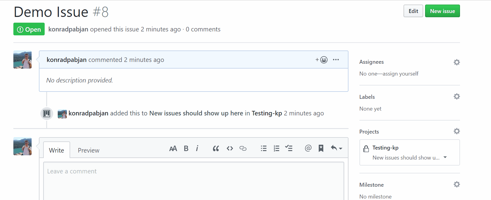

# actions-move-labeled-issue-repo

### Demo
This demo shows an issue that has the priority label added automatically get moved from column `New issues should show up here` to `Priority labeled stuff should automatically move here`

All in all takes less than 30 seconds from the time the label is added to the time the issue is moved in the project



### Use Case
Everytime a specific label is added to an issue, the associated card in a project should be moved to a specific column. For example, you want any issue that gets labeled with "priority" to automatically move to the column that corresponds to "on deck". If the issue is not on the project board, it will be created in the desired column. If it has already been added, it will be moved to the correct column.

This action can be used for projects that are linked and setup at the org level or repository level. The token that is supplied though must have `repo` permissions. If the project is linked at the org level, it must also have `org:read` permissions.

### Input

| Input | Description  |
|---------|---|
|  action-token | An access token that will be used to move or create an issue in a desired column. The standard token that is present for each action will not be sufficient as it does not have sufficient privilages. You must create one that has `repo` permissions  |
| project-url  | The url of the project. Will be something like `https://github.com/orgs/github/projects/1` or `https://github.com/konradpabjan/example/projects/1  |
| column-name | The name of the column in projec that issues should be moved to |
| label-name | The label that should trigger an issue to be moved to a specific column |
| columns-to-ignore | Comma seperated list of column names that should be ignored. If an issue/card already exists in a column with one of the names, it will be ignored. This is optional|


### Example YAML

This YAML is meant to be triggered whenever an issue has been labled.

```
on:
  issues:
    types: [labeled]
jobs:
  Move_Labeled_Issue_On_Project_Board:
    runs-on: ubuntu-latest
    steps:
    - uses: konradpabjan/actions-move-labeled-issue-repo@1fcae2621
      with:
        action-token: "${{ secrets.MY_TOKEN }}"
        project-url: "https://github.com/orgs/github/projects/1"
        column-name: "On Deck"
        label-name: "priority"
        columns-to-ignore: "In Review,Ready to deploy,Done"
 ```
